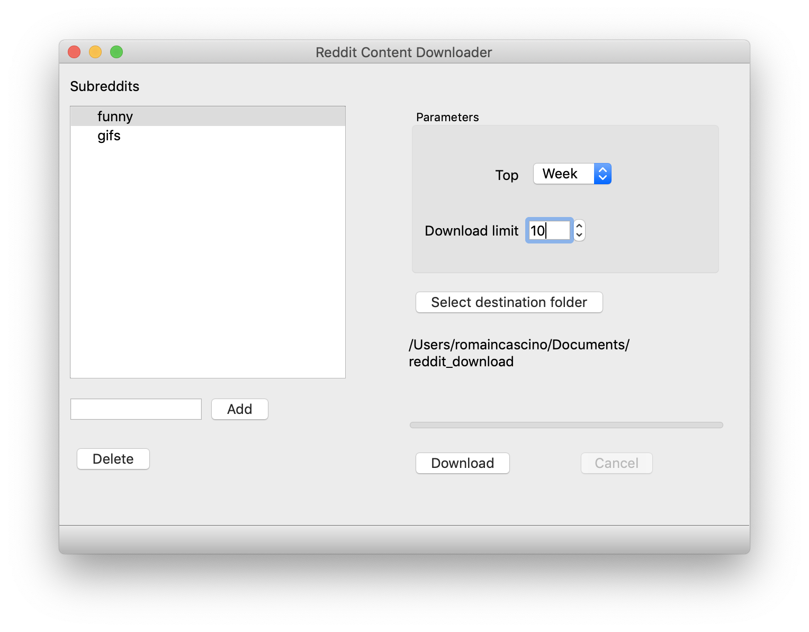

# Reddit content downloader

A python program to download content (images and videos) of multiples subreddits (sorted by *top*). Available as a Python 3 script or as a standalone app (currently available for Mac).

## Prerequisites

For both the app and the script, you will need to generate a client ID and a client secret as well as a user agent. 

Check out [this guide](https://github.com/reddit-archive/reddit/wiki/OAuth2-Quick-Start-Example#first-steps) to get your app's **client ID** and **secret**. 

Check out [this guide](https://github.com/reddit-archive/reddit/wiki/API#rules) to set up a correct **user agent**.

## App

You can find the Mac app in the `app/dist/` folder.

### Configuration

Go to *Settings* menu and fill the configuration values.

### Run

Add your subreddits using the *Add* button, select a limit and a top filter and select a folder destination for your downloads.

## Python script

### Prerequisites

- Install [ffmpeg](https://ffmpeg.org)

Run `pip install -r requirements.txt` to install project dependencies.

### Configuration

To make this works, you have to replace the values in `config/config.sample.json` with yours and save the file as `config/config.json`.

### Run

Use `python main.py` to run the script and download the top subreddits content. This will create a `download/` folder and a folder for each subreddits.

To choose the subreddits you want to download content from, you have two choices (by default, it will use the file `config/subreddits.json`):
- Add your subreddits in the `config/subreddits.sample.json` file and save the file as `config/subreddits.json`
- Directly write the subreddits after the command: `python main.py memes gifs` (will download from r/memes and r/gifs)

Two arguments are available: limit (`-l`) and time (`-t`). Use as below:

`python main.py -l <LIMIT> -t <TIME_FILTER>`

where `<LIMIT>` is an integer and `<TIME_FILTER>` is one of the following values: *all*, *day*, *hour*, *month*, *week*, *year* (default: *all*). Arguments are optional, default values are *10* for the download limit and *all* for the time filter.

Examples: 
- `python main.py -l 3 -t week` will download the top **3** posts content of the **week** using the list in **subreddits.json**
- `python main.py -l 10 -t all memes gifs` will download the top **10** posts content of **all time** from **r/memes** and **r/gifs**